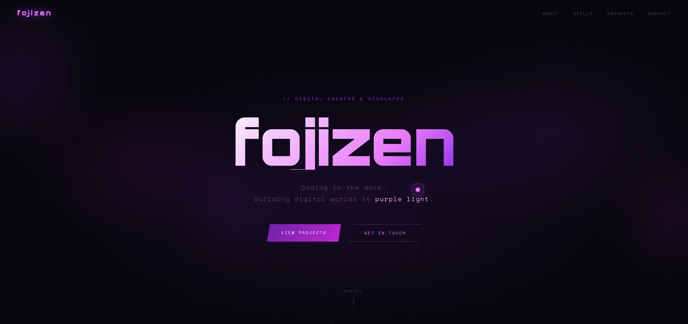

# 🚀 Fojizen Portfolio

Modern, minimal and interactive personal portfolio website built with HTML, CSS and JavaScript.

---

## 🌐 Live Demo
👉 https://fojizen.vercel.app

---

## 📸 Preview

---

## 🛠️ Built With

- HTML5
- CSS3 (Animations, Responsive Design, CSS Variables, Grid/Flexbox)
- JavaScript (Vanilla)
- Canvas API (Particles)
- Responsive Design

---

## ✨ Features

### 🌍 Internationalization (i18n)
- **Auto-detection** from browser language (Turkish/English)
- **Manual toggle** via EN/TR buttons in navigation
- **Persisted** preference in localStorage
- Full translation of all UI text, meta tags, and project descriptions

### 🎨 Visual Effects
- Custom cursor with smooth follower ring (GPU-accelerated)
- Particle system with spatial partitioning (30fps, 55 particles)
- Glitch text effect on hero name
- Floating gradient orbs with CSS animations
- Smooth scroll reveal animations

### ⚡ Performance Optimizations
- **30fps particle throttle** (was 60fps) — ~50% CPU reduction
- **Idle cursor pause** — ring stops after 3s of no mouse movement
- **Visibility API** — animations pause when tab is hidden
- **prefers-reduced-motion** — full disable for accessibility
- **Low-end detection** (≤4 cores) — auto-reduces particles to 40
- **Async font loading** with preconnect + print media hack
- **GPU-composited transforms** for cursor/particles

### 📱 Responsive Design
- Mobile-first breakpoints (768px, 480px)
- Hamburger menu with smooth slide-in
- 4:3 aspect-ratio project cards (square-ish)
- Touch-friendly (auto-disables custom cursor)

---

## 📁 Projects Featured

| Project | Description | Link |
|---------|-------------|------|
| **To Do List** | Clean task management app with LocalStorage persistence | [GitHub](https://github.com/fojizen/todo-app) |
| **AutoClickerPro** | Advanced auto-clicker with hotkeys, macros & click patterns | [GitHub](https://github.com/fojizen/AutoClickerPro) |

---

## 📌 About

This project is part of my personal branding as a Frontend Developer & UI/UX Designer.

---

## 📬 Contact

- GitHub: https://github.com/fojizen  
- Portfolio: https://fojizen.vercel.app  

---

⭐ If you like this project, give it a star!